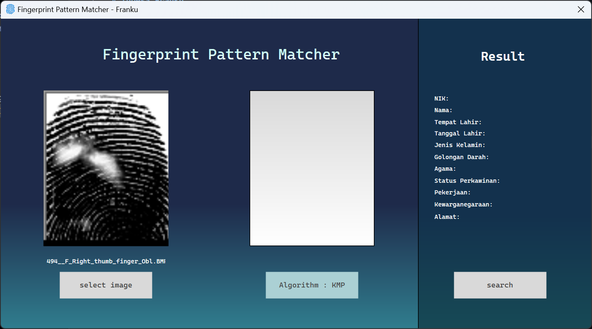
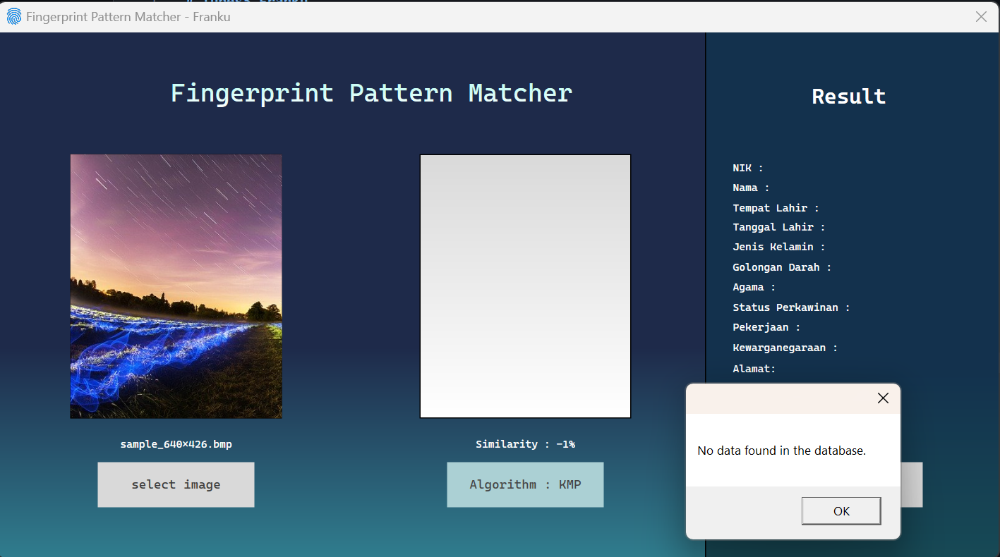

# Tubes3_Franku
> Tugas Besar 3 IF2211 Strategi Algoritma Semester II tahun 2023/2024 Pemanfaatan Pattern Matching dalam Membangun Sistem Deteksi Individu Berbasis Biometrik Melalui Citra Sidik Jari


## Table of Contents
* [General Info](#general-information)
* [Team Members](#team-members)
* [Technologies Used](#technologies-used)
* [Features](#features)
* [Setup](#setup)
* [Usage](#usage)
* [Screenshots](#screenshots)


## General Information
Fingerprint detection programs identify individuals based on unique fingerprint patterns using algorithms like Knuth-Morris-Pratt (KMP) and Boyer-Moore. The KMP algorithm efficiently searches for patterns within a text by building a prefix table to skip unnecessary comparisons, making it useful for matching fingerprint minutiae (key points like bifurcations and ridge endings) with stored templates. The Boyer-Moore algorithm, known for its efficiency with longer patterns, preprocesses the pattern to skip large sections of non-matching text, enhancing the search process in large fingerprint databases. Additionally, regular expressions (regex) play a crucial role in restoring corrupted fingerprint data by identifying and correcting malformed segments based on specific patterns. Together, these technologies ensure accurate identification and data integrity in fingerprint detection systems.

## Team Members
| **NIM**  |           **Name**             |
| :------: | :--------------------------:   |
| 13522024 |        Kristo Anugrah          |
| 13522038 |    Francesco Michael Kusuma    |
| 13522100 |  M. Hanief Fatkhan Nashrullah  |

## Technologies Used
- .NET Framework version 8
- SQLite


## Features
- Find fingerprint that best matches with the database.

## Setup

Make sure your golang version is appropriate. try running `dotnet --version`, if not found, it means your .NET installation is not correct. Required version 8 or higher. You can install go from this [.NET Framework](https://dotnet.microsoft.com/en-us/download/dotnet-framework)

Clone this project
```
git clone https://github.com/FrancescoMichael/Tubes3_Franku.git
```

## Usage

To run this project, from root project folder, run this command: 
```
cd src
dotnet clean
dotnet build
dotnet run
```

## Screenshots
<br/><br/><br/>
<br/><br/><br/>
<br/><br/><br/>
<br/><br/><br/>
<br/><br/><br/>
